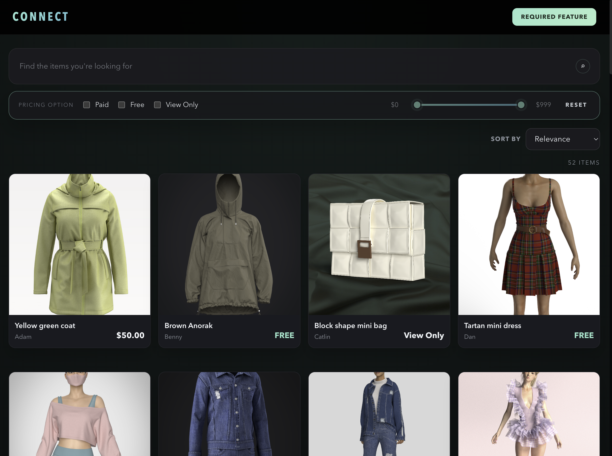

# CLO-SET CONNECT Store — Frontend Challenge

_해당 글은 대외비로 과제 진행자 외에 외부에 노출되지 않도록 주의해 주시기 바랍니다._

안녕하세요. CLO Virtual Fashion Front-end 직무에 지원해 주셔서 감사합니다.

이번 과제에서 수행하셔야 할 업무는 **제공되는 CLO-SET CONNECT Store Page의 레거시(Legacy) 코드를 분석하고, AI 도구를 적극 활용하여 코드의 취약점을 보완 및 최적화(Refactoring)하며 요구사항을 모두 구현하는 것**입니다.

## Getting Started

```bash
npm install
npm run dev
```

## API

- **Endpoint:** `GET https://closet-recruiting-api.azurewebsites.net/api/data`
- **Response:** `ContentItem[]` — 
  ```
    { 
      id, 
      creator, 
      title, 
      pricingOption, 
      imagePath, 
      price
    }
  ```

## 과제 진행 방법

- **진행 기간:** 지원자가 **원하는 날짜와 시간을 지정하여 시작한 뒤, 24시간 이내에 제출**합니다.
- **제출 방법:** Github public repository URL (제출 시 소스코드와 함께 AI 활용 진행 기록 첨부 필수).
- 작업 중 과제와 관련한 문의 사항이 있다면 메일(recruit@clo3d.com)로 전달해 주세요.

## AI 활용 가이드라인 (필수)

- **적극 권장:** 본 과제는 단순 구현보다 AI가 생성한 코드의 취약점을 보완하거나 시스템에 맞게 최적화하는 '검토 및 개선' 역량을 중점적으로 확인합니다. 과제 수행 시 AI 도구 사용을 적극 권장합니다.
- **사용 기록 제출 필수:** 지원자는 산출물 제출 시 반드시 AI를 어떤 방식으로 활용했는지(사용한 AI 모델, 주요 프롬프트 내용 등) 상세한 **진행 기록을 함께 제출**해야 합니다.

## 조건

- **React.js**와 **TypeScript** 환경에서 진행합니다.
- **Tanstack-Query, Jotai, Zustand, Redux 등 상태 관리 라이브러리를 사용을 권장합니다.**
- CSS 라이브러리(Emotion.js, TailwindCSS, vanilla-extract 등) 및 test-code lib는 자유롭게 사용 가능합니다.
- 로컬 환경에서 프로젝트를 실행할 수 있어야 합니다 (ex. `npm run dev`, `npm run preview` 실행 시 로컬 환경에서 확인).
- Git을 사용한 버전 관리를 수행합니다.
- 주어진 API(데이터)는 반드시 사용해야 합니다.
- 구현하기 위해 사용할 수 있는 패키지(Vite 등 번들러 포함)에는 제한이 없으나 사용한 이유를 명시해야 합니다.

## 요구사항

### 1. Contents Filter 및 Keyword Search

- **Pricing Option:** 세 가지 옵션(Paid, Free, View Only) 다중 선택 가능하며, 선택한 옵션에 따라 리스트 필터링이 구현되어야 합니다.
- **Keyword Search:** 검색 키워드를 기준으로 필터링을 구현합니다 (제목, 유저 이름 등).
- **복합 검색:** 키워드와 Pricing Option 조합 검색을 지원해야 합니다.
- **Reset 및 상태 유지:** Reset 버튼 클릭 시 초기화되어야 합니다. 필터링/검색 결과는 새로고침 시에도 유지되어야 합니다 (browser storage 사용 지양).

### 2. Contents List 및 Skeleton UI

- 각 상품의 사진, 유저 이름, 제목, 가격(Paid일 경우) 및 옵션을 표시합니다.
- **반응형 그리드 시스템 적용:** 유저가 사용하는 디바이스의 가로 길이에 따라 column 개수를 변경합니다 (기본 4개, 1200px 이하 3개, 768px 이하 2개, 480px 이하 1개).
- **Infinite Scroll:** 리스트 추가 로드 구현 및 로딩 시 보여질 **Skeleton UI**를 구현합니다.

### 3. Sorting (정렬)

- Dropdown 형태로 정렬을 구현합니다 (Item Name(Default), Higher Price, Lower Price). 동일 값 2차 정렬은 고려하지 않아도 됩니다.

### 4. Pricing Slider

- Range slider 형태(최소 0, 최대 999)로 구현하며, Paid 옵션 선택 시 활성화되도록 합니다.
- Handle 드래그 앤 드롭 시 금액이 표시되며 해당 사이 아이템만 필터링합니다 (Handle 교차 불가).

### 5. Test Code 작성

- 주요 로직에 대한 테스트 코드를 작성해 주세요.

## 기능 동작 명확화

- **Reset 동작 범위:** Reset 클릭 시 검색 키워드, Pricing Option, Pricing Slider 값, 정렬 옵션, 현재까지 추가 로드된 리스트 상태를 모두 초기 상태로 되돌려야 합니다.
- **초기 상태 기준:** `검색어 없음`, `Pricing Option 미선택`, `가격 범위 전체(0~999)`, `정렬: Item Name(Default)`, `리스트 초기 노출 상태`.
- **새로고침 후 상태 유지:** `localStorage`, `sessionStorage` 등 browser storage 사용은 지양하며, URL query parameter 등 브라우저 새로고침에 안전한 방식으로 상태를 유지해 주세요.
- **Keyword Search 범위:** 제목(`title`)과 유저 이름(`creator`) 기준으로 검색, 대소문자 구분 없음.
- **복합 필터 적용 범위:** Keyword Search, Pricing Option, Pricing Slider, Sorting은 서로 함께 동작해야 하며, 한 조건의 변경이 다른 조건을 해제시키면 안 됩니다.
- **Sorting 적용 기준:** 필터링된 결과 전체에 적용, `Higher Price` / `Lower Price`는 문자열이 아닌 숫자 가격 기준.
- **Pricing Slider 활성화 조건:** Paid 옵션이 선택되지 않은 경우 slider는 비활성화 상태이며, 가격 범위 조건은 필터링에 적용되지 않습니다.
- **Pricing Slider 필터 기준:** Paid 옵션 선택 시에만 적용, 범위 양 끝값 포함.
- **Infinite Scroll:** API가 cursor/page 기반 페이지네이션을 제공하지 않는 경우, 프론트엔드에서 클라이언트 단 페이지네이션으로 구현 가능. 로딩 중 Skeleton UI 필수.
- **No Result 상태:** 필터 조건에 맞는 아이템이 없을 경우 사용자가 현재 상태를 이해할 수 있는 메시지나 화면을 제공.
- **Test Code 범위:** 필터링/정렬/가격 범위/상태 유지 등 사용자 경험에 직접 영향을 주는 주요 로직 포함.

## 리소스

**Pricing Option enum:**

```ts
enum PricingOption {
  PAID = 0,
  FREE = 1,
  VIEW_ONLY = 2,
}
```

**디자인 참고:**

